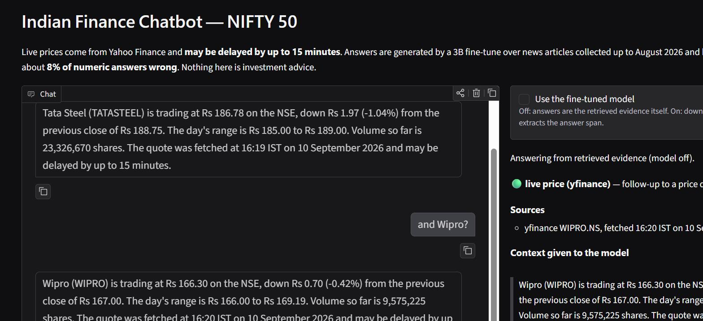

# Finance Chatbot — Indian Stock Market

A question-answering system for NIFTY 50 companies: a Llama-3.2-3B fine-tune that extracts answers
from financial text, wrapped in a retrieval layer that decides where the text comes from — a live
price feed, or a corpus of 10,257 news paragraphs — and refuses when it has neither.

An original rebuild of the WIDS (Winter in Data Science) project in
[`docs/project-report.pdf`](docs/project-report.pdf): same methodology, reimplemented from scratch
with a dataset built from the ground up, no hardcoded secrets, and a concept guide for every
technique it uses.

```bash
pip install -r requirements.txt
python -m src.app.ui              # http://127.0.0.1:7860, up in a few seconds
```

## What it does

```
                    ┌─ price wording AND a NIFTY 50 company ──> yfinance quote ─┐
question ─> route ──┼─ a company, anything else ──────────────> news corpus ────┼─> context ─> model ─> answer
                    └─ no company resolved ───────────────────> refuse          ┘                       + sources
```

The fine-tune is an **extractor**, not an oracle: it was trained on 6,368 `{question, context,
answer}` triplets to pull an answer span out of a passage it is given. So the app's job is to make
sure it never runs without one — and to say so plainly when it can't find one, rather than letting
a model that was trained to always produce a confident short answer produce one anyway.

Every answer shows its route, its sources (article URL and **date**, or the quote's fetch time) and
the exact context the model was handed.

## Results

Fine-tuned vs. the un-fine-tuned base, on 300 held-out test examples that share no source articles
with training:

| Metric | Base | Fine-tuned | |
|---|---|---|---|
| Exact match | 11.7 | **76.3** | +64.7 |
| Token F1 | 40.8 | **91.5** | +50.7 |
| Numeric accuracy | 63.8 | **91.9** | +28.1 |

Retrieval, measured on the same 300 questions: the company matcher resolves the right company for
**99.7%** of them and never the wrong one; the answer is present in the retrieved context **69.0%**
of the time. Intent routing scores **34/36** on a hand-labelled battery.

**Read [the limitations](docs/training-results.md#reading-these-numbers-honestly) before trusting
any of that.** The short version: the test answers were written by the same teacher model as the
training answers, so these numbers measure agreement with a teacher, not truth; about **8% of
numeric answers are still wrong**; and coverage is uneven across the 50 companies (36 to 254
training examples each). Nothing here is investment advice.

## Model

Published on the Hub, merged into fp16 so it loads with a plain `from_pretrained` — no `peft`, no
access to the gated base repo:

- **[Llama-3.2-3B-finance-india](https://huggingface.co/Himanshu724006/Llama-3.2-3B-finance-india)** — merged model, 6.43 GB
- **[Llama-3.2-3B-finance-india-lora](https://huggingface.co/Himanshu724006/Llama-3.2-3B-finance-india-lora)** — the adapter alone, 195 MB

```python
from transformers import AutoModelForCausalLM, AutoTokenizer

name = "Himanshu724006/Llama-3.2-3B-finance-india"
model = AutoModelForCausalLM.from_pretrained(name, device_map="auto")
tokenizer = AutoTokenizer.from_pretrained(name)
```

Prompt it the way it was trained — `src/training/format.py` is the single definition, shared by
training, evaluation and serving.

## Running it



*A price question, then `and Wipro?` — the follow-up inherits the route, and the panel shows where
the number came from and exactly what the model was handed.*

The app starts in **retrieval-only mode**: TF-IDF over the news corpus plus live quotes, answering
with the retrieved evidence itself. The 6.4 GB model sits behind a checkbox, so the interface is
useful immediately and you can see side by side what the fine-tune contributes — the paragraph,
versus the span pulled out of it.

Conversation state is deliberately thin. The model was trained on single turns and has no chat
template, so history never enters the prompt; the UI carries only the last company and route, per
session, which is enough for *"What is Reliance trading at?" → "and Wipro?"* to work, and it says
when it assumed one.

The same pipeline runs from the command line:

```bash
python -m src.app.pipeline "What is Tata Steel trading at?"     # live NSE quote
python -m src.app.pipeline "Why is Tata Steel restructuring?"   # news corpus + sources
python -m src.app.pipeline "How is Wipro's AI business doing?" --model    # add the fine-tune
```

```bash
pytest        # 96 tests, ~12 s, no network and no model download
```

The suite injects a fake price feed, a fake clock, a fake corpus and a fake generator, so every
routing and refusal path is covered offline. Tests needing the built dataset skip themselves on a
fresh clone.

## How it was built

| | Step | Where |
|---|---|---|
| 1 | Scrape NIFTY 50 news via published sitemaps, robots-aware and rate-limited — 2,014 articles ([Guide 02](docs/guides/02-collecting-a-training-corpus.md)) | local |
| 2 | Clean, deduplicate, filter unattributable paragraphs — 18,098 → 10,257 ([Guide 03](docs/guides/03-generating-a-qa-dataset.md)) | local |
| 3 | Split **by article** before generating anything, so no article spans two splits | local |
| 4 | Generate QA pairs with Qwen2.5-7B-Instruct, validate every one — 11,590 → **8,292** ([Guide 01](docs/guides/01-dataset-design-for-llm-finetuning.md), [03](docs/guides/03-generating-a-qa-dataset.md)) | Kaggle T4 |
| 5 | LoRA r=32 over a 4-bit NF4 base, loss masked to the answer tokens ([Guide 04](docs/guides/04-lora-and-4bit-fine-tuning.md)) | Kaggle T4 |
| 6 | Merge in **fp16, not 4-bit**, and publish with a real model card ([Guide 05](docs/guides/05-merging-and-publishing-a-model.md)) | Kaggle CPU |
| 7 | Retrieval + routing, tuned against measurements ([Guide 06](docs/guides/06-retrieval-and-the-app-layer.md)) | local |
| 8 | Gradio UI and an offline test suite ([Guide 07](docs/guides/07-serving-a-small-model.md)) | local |

Full runbook with timings and expected outputs: [`docs/reproducing.md`](docs/reproducing.md).

## Project layout

```
src/scraping/    sitemaps, robots-aware fetcher, company matching, article extraction
src/dataset/     cleaning, splitting, QA validation, dataset assembly
src/training/    prompt format (single source of truth), metrics, LoRA merge
src/app/         retrieval, routing, pipeline, model wrapper, Gradio UI
tests/           96 tests, all offline
notebooks/       QA generation, fine-tuning, merge + publish (Kaggle)
data/  models/   gitignored — rebuildable, see docs/reproducing.md
```

## Docs

- [`reproducing.md`](docs/reproducing.md) — rebuild everything from an empty `data/`
- [`setup.md`](docs/setup.md) — install, secrets, and the traps worth knowing about
- [`dataset-design.md`](docs/dataset-design.md) — schema, sourcing, compliance, and the finished dataset's provenance
- [`training-results.md`](docs/training-results.md) — training setup, the loss curve, results and limitations
- [`guides/`](docs/guides/) — a concept guide per technique, written to explain *why*, not just *what*
- [`PLAN.md`](docs/PLAN.md) — the 12-day build plan and progress

## Licensing and attribution

Built with Llama. The published models are derivatives of `meta-llama/Llama-3.2-3B-Instruct` under
the [Llama 3.2 Community License](https://github.com/meta-llama/llama-models/blob/main/models/llama3_2/LICENSE),
which is why their names begin with `Llama`. QA pairs were generated with Qwen2.5-7B-Instruct
(Apache 2.0). Source article text remains the copyright of its publisher and is **not**
redistributed here — the repo ships the code that rebuilds the corpus, not the corpus.
